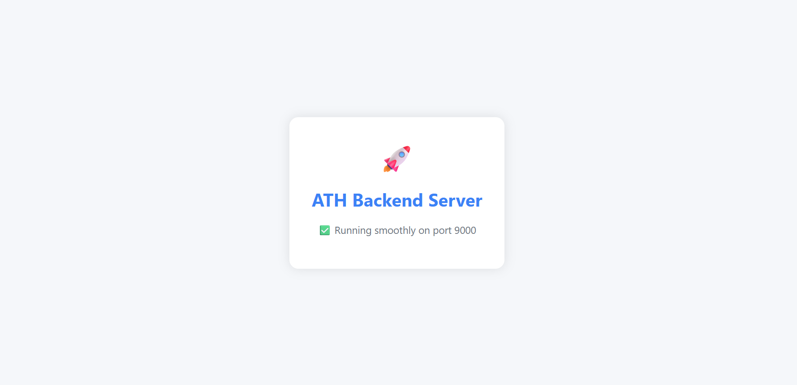

<h1 align="center">Aditya Transport Hub - Backend</h1>

  

<p align="center">
  🚍 <b>IoT-Enabled Smart Bus Tracking and Management Backend System</b> 🚍
</p>

---

## 🧠 Overview

The **Aditya Transport Hub** backend powers a full-stack smart transport management system for **Aditya University**. It connects the frontend interface with live IoT devices, enabling real-time bus tracking, user management, notifications, and much more.

This backend handles:
- Real-time tracking of university buses via GPS/IoT integration
- Secure user authentication for admins and students
- Dynamic route & schedule management
- MongoDB-based persistent data storage
- RESTful APIs for frontend communication

---

## 🚀 Tech Stack

| Category        | Technologies Used                             |
|----------------|-----------------------------------------------|
| Runtime         | Node.js                                       |
| Framework       | Express.js                                    |
| Database        | MongoDB (with Mongoose ORM)                   |
| Hosting         | Vercel (Serverless API Deployment)            |
| Middleware      | Morgan, Body-Parser, Cors                     |
| Authentication  | JWT (JSON Web Tokens)                         |
| Environment     | dotenv (.env configs for secrets)             |

---

## 📦 Installation

```bash
# Clone the repository
git clone https://github.com/nryadav18/ath.backend.git
cd ath.backend

# Install dependencies
npm install

# Set up environment variables
cp .env.example .env
# Replace values in the .env file

# Start the development server
npm run dev
